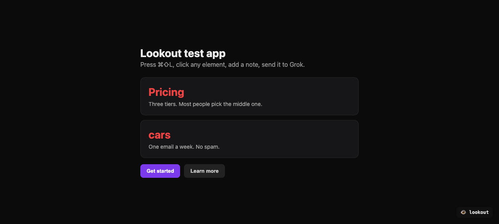

<div align="center">
  
  <h1 align="center" style="border-bottom: none; margin-bottom: 0;">Lookout</h1>
  <h3 align="center" style="margin-top: 0; font-weight: normal;">
    click an element, type a note, grok edits the source
  </h3>
</div>

<br />

## 🚀 Quick Start

```bash
git clone https://github.com/stevederico/lookout.git
cd lookout/example
bun install
bun run dev
```

Open [http://127.0.0.1:5173](http://127.0.0.1:5173). In a second terminal:

```bash
cd lookout/example
LOOKOUT_ENV=../.env node ../bin/grok-daemon.mjs
```

Copy `.env.example` to `.env` and set `XAI_API_KEY`. Press **⌘⇧L**, click an element, type the change, Enter. The page hot-reloads.

<br />

## ✨ What's Included

### 👁 **Dev overlay**
- **⌘⇧L** or the `lookout` badge toggles pick mode
- **Hover** highlights the element; **click** opens a note
- **Dev-only** — Vite `apply: 'serve'`. No browser extension. No production bundle

### ⚡ **Warm Grok daemon**
- **Finds** the source file from the clicked text
- **Asks** Grok for a surgical find/replace
- **Writes** the file. Live run on grok-4.6: **1.8s**

### 🔌 **Vite bridge**
- **POST /__lookout** queues a selection
- **GET /__lookout/next** is the daemon long-poll
- **GET /__lookout/wait/:id** is the browser long-poll

<br />

## 📖 How It Works

```
[overlay] --click+note--> [Vite /__lookout] --/next--> [Grok daemon] --edit--> source file
                                |
                    long-poll /wait/:id <-- result
```

1. The plugin injects the overlay into the dev page only.
2. A click POSTs selector, text, HTML, and your note.
3. The daemon claims `/next`, walks the project for that text, calls `https://api.x.ai/v1/chat/completions`.
4. It applies the returned `find` / `replace` and POSTs `/done`. Vite HMR reloads the page.

```js
import { defineConfig } from 'vite'
import lookout from 'lookout'

export default defineConfig({ plugins: [lookout()] })
```

<br />

## ⚙️ Configuration

Copy `.env.example` to `.env` (gitignored). Never commit a key.

```
XAI_API_KEY=
```

| Var | Default | Meaning |
|---|---|---|
| `XAI_API_KEY` | `.env` or `LOOKOUT_ENV` | xAI key. Server-side only |
| `LOOKOUT_PORT` | `5173` | Vite dev port |
| `LOOKOUT_HOST` | `http://127.0.0.1:$PORT` | Bridge origin |
| `LOOKOUT_ROOT` | `cwd` | Tree the daemon may edit |
| `LOOKOUT_MODEL` | `grok-4.6` | xAI model |
| `LOOKOUT_REASONING` | `low` | `reasoning_effort` |
| `LOOKOUT_ENV` | `$LOOKOUT_ROOT/.env` | Alternate env file |

In your own Vite app:

```bash
bun add -d lookout
LOOKOUT_ROOT="$PWD" node node_modules/lookout/bin/grok-daemon.mjs
```

Edits append JSONL to `.lookout/changes.log` (gitignored).

<br />

## 🧩 Tech Stack

| Technology | Version | Purpose |
|---|---|---|
| **Vite** | `>=4` (example `5.4`) | Plugin + HMR |
| **Node** | 18+ | Daemon (`fetch`) |
| **Grok 4.6** | xAI Chat Completions | Surgical edit |
| **Bun** | optional | Install + `bun run dev` |

Zero runtime dependencies. Peer: Vite.

<br />

## 🧪 Smoke

```bash
XAI_API_KEY=… bun run smoke
```

Pings grok-4.6. Skips the live call if no key.

<br />

## 🤝 Contributing

```bash
git clone https://github.com/stevederico/lookout.git
cd lookout/example && bun install && bun run dev
```

Keep the daemon on `127.0.0.1`. Do not commit `.env`.

<br />

## 💬 Community

- [Issues](https://github.com/stevederico/lookout/issues)
- [x.com/stevederico](https://x.com/stevederico)

<br />

## 🙏 Acknowledgements

- **[Vite](https://vite.dev)** — dev server and plugin API
- **[xAI Grok](https://docs.x.ai)** — edit model

<br />

## ⭐ Try It

```bash
bun add -d lookout
```

Click. Note. Edit.

<br />

## 📄 License

[MIT License](LICENSE)

<br />

<div align="center">
  <sub>Built with Vite and Grok. Dev-only. <a href="https://github.com/stevederico/lookout">Star the repo</a>.</sub>
</div>
